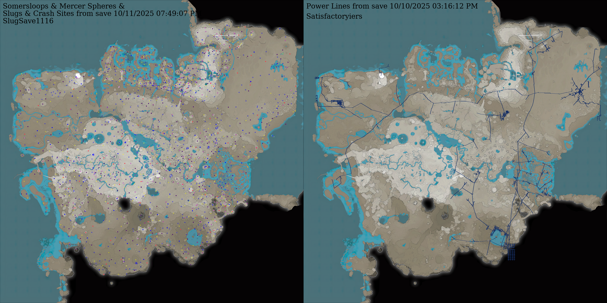

# Satisfactory Save Parser

Copyright (c) 2024-2025 [GreyHak](https://github.com/GreyHak)

A set of Python tools for parsing Satisfactory save files, and then displaying
and manipulating the contents.  Updated to support v1.1.1.6.

[Satisfactory](https://www.satisfactorygame.com/) is a non-competitive,
first-person, open-world, factory-building and exploration game produced by
[Coffee Stain Studios](https://www.coffeestain.com/).

Table of Contents:
- [sav_parse.py](#sav_parsepy) - Parser script
- [sav_to_resave.py](#sav_to_resavepy) - Save generation script
- [sav_cli.py](#sav_clipy) - Save editor CLI
- [sav_to_html.py](#sav_to_htmlpy) - HTML and Map generator
- [sav_monitor.py](#sav_monitorpy) - Automation for sav_to_html.py
- [Credits](#credits) and Thanks
- [License](#license)

## sav_parse.py

`sav_parse.py` will decode the save file.  It can be used as either a library
or a program.

When used as a library, call `sav_parse.readFullSaveFile(filename: str)` to
parse the entire save file, or `sav_parse.readSaveFileInfo(filename: str)` to
parse just the header information.

When used as a program, from the command line call `py sav_parse.py <filename>`
to generate a text file representation of the save file.

## sav_to_resave.py

`sav_to_resave.py` will create a save file based on the data producted by
`sav_parse.py` or a manipulated varient of that data.  The interface is
`saveFile(parsedSave: sav_parse.ParsedSave, outFilename: str)` where
the first parameter are the variable returned by `sav_parse.readSaveFileInfo`.

## sav_cli.py

`sav_cli.py` makes use of `sav_parse.py` and `sav_to_resave.py` to either
provide specific information from the save file or change data in a save file.

Usage:
  - `py sav_cli.py --help`
  - `py sav_cli.py --info <save-filename>`
  - `py sav_cli.py --to-json <save-filename> <output-json-filename>`
  - `py sav_cli.py --from-json <input-json-filename> <new-save-filename>`
  - `py sav_cli.py --set-session-name <new-session-name> <original-save-filename> <new-save-filename>`
  - `py sav_cli.py --find-free-stuff [item] [save-filename]`
  - `py sav_cli.py --list-players <save-filename>`
  - `py sav_cli.py --list-player-inventory <player-num> <save-filename>`
  - `py sav_cli.py --export-player-inventory <player-num> <save-filename> <output-json-filename>`
  - `py sav_cli.py --import-player-inventory <player-num> <original-save-filename> <input-json-filename> <new-save-filename> [--same-time]`
  - `py sav_cli.py --tweak-player-inventory <player-num> <slot-index> <item> <quantity> <original-save-filename> <new-save-filename> [--same-time]`
  - `py sav_cli.py --rotate-foundations <primary-color-hex-or-preset> <secondary-color-hex-or-preset> <original-save-filename> <new-save-filename> [--same-time]`
  - `py sav_cli.py --clear-fog <original-save-filename> <new-save-filename> [--same-time]`
  - `py sav_cli.py --export-hotbar <player-num> <save-filename> <output-json-filename>`
  - `py sav_cli.py --import-hotbar <player-num> <original-save-filename> <input-json-filename> <new-save-filename> [--same-time]`
  - `py sav_cli.py --change-num-inventory-slots <num-inventory-slots> <original-save-filename> <new-save-filename> [--same-time]`
  - `py sav_cli.py --restore-somersloops <original-save-filename> <new-save-filename> [--same-time]`
  - `py sav_cli.py --restore-mercer-spheres <original-save-filename> <new-save-filename> [--same-time]`
  - `py sav_cli.py --export-somersloops <save-filename> <output-json-filename>`
  - `py sav_cli.py --export-mercer-spheres <save-filename> <output-json-filename>`
  - `py sav_cli.py --import-somersloops <original-save-filename> <input-json-filename> <new-save-filename> [--same-time]`
  - `py sav_cli.py --import-mercer-spheres <original-save-filename> <input-json-filename> <new-save-filename> [--same-time]`
  - `py sav_cli.py --remember-username <player-num> <username-alias>`
  - `py sav_cli.py --list-vehicle-paths <save-filename>`
  - `py sav_cli.py --export-vehicle-path <path-name> <save-filename> <output-json-filename>`
  - `py sav_cli.py --import-vehicle-path <path-name> <original-save-filename> <input-json-filename> <new-save-filename> [--same-time]`
  - `py sav_cli.py --export-dimensional-depot <save-filename> <output-json-filename>`
  - `py sav_cli.py --reorder-dimensional-depot <original-save-filename> <input-json-filename> <new-save-filename> [--same-time]`
  - `py sav_cli.py --adjust-dimensional-depot <original-save-filename> <item-name> <new-quantity> <new-save-filename> [--same-time]`
  - `py sav_cli.py --export-crash-sites <save-filename> <output-json-filename>`
  - `py sav_cli.py --blueprint --show <save-filename>`
  - `py sav_cli.py --blueprint --sort <original-save-filename> <new-save-filename> [--same-time]`
  - `py sav_cli.py --blueprint --export <save-filename> <output-json-filename>`
  - `py sav_cli.py --blueprint --import <original-save-filename> <input-json-filename> <new-save-filename> [--same-time]`
  - `py sav_cli.py --blueprint --add-category <category> <original-save-filename> <new-save-filename> [--same-time]`
  - `py sav_cli.py --blueprint --add-subcategory <category> <subcategory> <original-save-filename> <new-save-filename> [--same-time]`
  - `py sav_cli.py --blueprint --add-blueprint <category> <subcategory> <blueprint> <original-save-filename> <new-save-filename> [--same-time]`
  - `py sav_cli.py --blueprint --remove-category <category> <original-save-filename> <new-save-filename> [--same-time]`
  - `py sav_cli.py --blueprint --remove-subcategory <category> <subcategory> <original-save-filename> <new-save-filename> [--same-time]`
  - `py sav_cli.py --blueprint --remove-blueprint <category> <subcategory> <blueprint> <original-save-filename> <new-save-filename> [--same-time]`
  - `py sav_cli.py --blueprint --move-blueprint <old-category> <old-subcategory> <new-category> <new-subcategory> <blueprint> <original-save-filename> <new-save-filename> [--same-time]`
  - `py sav_cli.py --blueprint --reset <original-save-filename> <new-save-filename> [--same-time]`
  - `py sav_cli.py --resave-only <original-save-filename> <new-save-filename>`

If `--find-free-stuff` is used inconjunction with `sav_to_html.py` and a blank
map, it will generate a map of all the locations for the specified item.

With v1.0.0.4 release, there isn't much point to the `--blueprint --sort`
operation since the game's reverse-sorting is performed on save-open time.

## sav_to_html.py

`sav_to_html.py` can be used as either a library or a program.

Command line: `py sav_to_html.py <save-filename> [output-html-file]`

Library: `sav_to_html.generateHTML(savFilePath: str, outputDirectory: str, htmlBaseName: str)`

`sav_to_html.py` makes use of `sav_parse.py` to decode a save file and creates
a save.html.  The HTML page contains:
  - Session Name
  - Save Date
  - Play Time
  - Game Phase
  - Active Milestone
  - Mined Resource Count
  - Collected Power Slugs, Somersloops, and Mercer Sphere Counts
  - Unopened, Looted, and Opened/Unlooted Hard Drive Counts
  - Unlock Progress Counts
  - Sink Point Progress
  - Dimensional Depot Contains: List by item with quantity and percent full
  - Currently Built Items: List of items by quantity

When a blank map, included in the release as `blank_map20.png`,
is provided, this script also creates maps of:
  - The location of all the remaining power slugs.
  - The location of all the remaining somersloops.
  - The location of all the remaining mercer spheres.
  - The location of all the hard drives including which are opened, looted and
    opened/unlooted.
  - The power grid.
  - The resource nodes including their type, locations, purity, and usage.

The map size can be increased or decreased by changing two things.
`blank_map20.png` is 2048x2048.  The "20" in the filename is a scale,
configured in `sav_to_html.py` by the variable `MAP_DESCALE`.  The size is
relative to a scale of 1 representing 40960x40960.  So 2048 = 40960 / 20.
A slightly larger map than the default could be `MAP_DESCALE = 16` and a
2560x2560 `blank_map16.png`.  You can either manually resize `blank_map20.png`
yourself, or contact grey.hak on Discord or submit an Issue request on github.

The maps get labeled using the .ttf font file defined in `sav_to_html.py` by the variable
`FONT_FILENAME`.  On Linux this defaults to `/usr/share/fonts/truetype/dejavu/DejaVuSerif.ttf`.
On Windows this defaults to `C:\Windows\Fonts\DejaVuSerif.ttf`.  If neither of
these files are available on your system, you can obtain a .ttf font file from
[https://github.com/kiwi0fruit/open-fonts](https://github.com/kiwi0fruit/open-fonts).

### Legend: save_all_collectables.png

- Somersloops and Mercer Spheres are solid circles.
Somersloops are red  and
Mercer Spheres are dark purple .
- Slugs are non-solid circle outlines;
 blue,
 yellow and
 purple.

### Legend: save_nodes.png

- The size of the circle is smaller if the node is mined, and larger if the node is unused.
- The center color represents the node purity;
      for impure,
      for normal,
      for pure
- The outline color represents the node type;
   -  for goal
   -  for geyser
   -  for oil
   -  for nitrogen gas
   -  for bauxite
   -  for copper
   -  for caterium
   -  for iron
   -  for uranium
   -  for raw quartz
   -  for SAM
   -  for limestone
   -  for sulfur
   -  for water

### Legend: save_hd.png

-  blue: unopened
-  green: open with drive
-  white: open and empty
-  cyan: dismantled

## sav_monitor.py

Usage: `py sav_monitor.py [save-directory] [html-output-directory] [monitor-period] [archive-directory]`

`sav_monitor.py` will check for new save files, generate html/png summary of
new save files, and optionally archive the save files.

`[save-directory]` defaults to `.config/Epic/FactoryGame/Saved/SaveGames/server`
or `%LOCALAPPDATA%/FactoryGame/Saved/SaveGames/*.`  The `[save-directory]` must
exist for the monitor to start.

`[html-output-directory]` defaults to the current-working-directory.  HTML and
map generation is only performed if the provided `[html-output-directory]` exists.

`[monitor-period]` is the rate in seconds that the monitor looks for new saves.
The default `[monitor-period]` is 1.0 second.  Settings between 0.2 and 120.0
would be completely reasonable.

Archiving is only performed if the `[archive-directory]` is provided and exists.

## Credits

The source code in this repo was developed by [GreyHak](https://github.com/GreyHak).

Source code credit for the the quaternion/euler rotation conversions used by
`sav_cli.py` goes to [**Addison Sears-Collins**](https://automaticaddison.com).

Thanks go to **[AnthorNet](https://github.com/AnthorNet)** of [Satisfactory
Calculator Interactive Map](https://satisfactory-calculator.com/en/interactive-map)
fame.
* The map used by `sav_to_html.py` is a modified version of the map extracted
  from Anthor's Interactive Map.
* Resource purities, available in the `sav_parse.py` RESOURCE_PURITY variable,
  used by `sav_to_html.py`, were extracted from Anthor's Interactive Map.
* Anthor's [pre-Update-8 JavaScript code](https://github.com/AnthorNet/SC-InteractiveMap/blob/dev/src/SaveParser/Read.js)
  was used as a reference.
* Anthor's Interactive Map was also a great test tool to verify the save files
  produced by `sav_to_resave.py` and `sav_cli.py`.

Thanks go to the Wiki authors who documented the old, but still very helpful,
v0.6.1.3 version of the save file format at
[Satisfactory GG Wiki Save Files](https://satisfactory.wiki.gg/wiki/Save_files#Save_file_format).
I updated the Satisfactory GG Wiki for v1.0.0.4 based on the information I
gained during creation of this tools.

Thanks to
[robison4th](https://github.com/robison4th),
[JP Eagles and Katz](https://www.youtube.com/channel/UCgIwAJga0I6i68bWfwPdj1w),
[Buggy](https://github.com/Buggy123),
[Tomtores](https://github.com/Tomtores),
[Mattigins](https://steamcommunity.com/profiles/76561198081088435), and
[TheRealBeef](https://github.com/TheRealBeef)
for sharing their save files to allow for expanded support.

## License

This program is free software: you can redistribute it and/or modify
it under the terms of the GNU General Public License as published by
the Free Software Foundation, version 3.

This program is distributed in the hope that it will be useful, but
WITHOUT ANY WARRANTY; without even the implied warranty of
MERCHANTABILITY or FITNESS FOR A PARTICULAR PURPOSE. See the GNU
General Public License for more details.

You should have received a copy of the GNU General Public License
along with this program. If not, see <https://www.gnu.org/licenses/>.
